<div align="center">

# AI Engineering Toolkit

### One command. Your prompt goes from 28 → 82. No manual work.

<br>



<br>

[](https://github.com/viliawang-pm/ai-engineering-toolkit)
[](https://github.com/viliawang-pm/ai-engineering-toolkit/fork)
[](LICENSE)
[]()
[]()
[]()

**Install in 5 seconds** — paste this into Claude Code or WorkBuddy:

```
/skill install -g viliawang-pm/ai-engineering-toolkit
```

[What's Inside](#-whats-inside) · [See It in Action](#-see-it-in-action) · [Quick Start](#-quick-start) · [Contributing](#-contributing)

</div>

---

## Why This Exists

You already know what RAG, prompt engineering, and context windows are. The problem is the **gap between knowing and doing** — you sit down to build, and you're back to Stack Overflow, trial-and-error, and "looks good to me" code reviews.

This toolkit fills that gap with **6 executable workflows** that your AI agent loads and follows step by step. Not theory. Not blog posts. Actual structured processes — the kind a senior AI engineer would run.

> **Think of it this way:** your AI agent already writes great code. These skills teach it how to *engineer* — evaluate prompts, optimize context, design RAG pipelines, audit agent security, and build eval frameworks.

## 📦 What's Inside

| # | Skill | What It Does | Highlight |
|:-:|-------|-------------|-----------|
| 1 | **[prompt-evaluator](skills/prompt-evaluator/)** | Score any LLM prompt across 8 quality dimensions (0-100), then auto-generate an optimized rewrite | Supports single eval, A/B comparison, and batch mode |
| 2 | **[context-budget-planner](skills/context-budget-planner/)** | Plan token allocation across 5 context zones, find waste, optimize cost-quality tradeoffs | Includes allocation profiles for 6 common use cases |
| 3 | **[rag-pipeline-architect](skills/rag-pipeline-architect/)** | Design end-to-end RAG systems from document ingestion to retrieval evaluation | Covers Naive → Advanced → Modular RAG with decision trees |
| 4 | **[agent-safety-guard](skills/agent-safety-guard/)** | Implement defense-in-depth security with 5-layer protection and red-team testing | 65+ test cases across 5 attack categories |
| 5 | **[eval-harness-builder](skills/eval-harness-builder/)** | Build systematic evaluation frameworks with automated metrics and LLM-as-Judge | CI/CD integration templates included |
| 6 | **[product-sense-coach](https://github.com/viliawang-pm/product-sense-coach)** | A thinking partner for PMs — sharpen product intuition through guided conversation | Standalone repo — 5-phase framework inspired by first-principles product thinking |

## 🚀 Quick Start

### Option 1: One-line install (Claude Code / WorkBuddy)

```bash
# Install the entire toolkit
/skill install -g viliawang-pm/ai-engineering-toolkit

# Or install a single skill
/skill install -g viliawang-pm/ai-engineering-toolkit/prompt-evaluator
```

### Option 2: Manual install

```bash
# Clone and copy to your global skills directory
git clone https://github.com/viliawang-pm/ai-engineering-toolkit.git
cp -r ai-engineering-toolkit/skills/prompt-evaluator ~/.claude/skills/
# or for WorkBuddy:
cp -r ai-engineering-toolkit/skills/prompt-evaluator ~/.workbuddy/skills/
```

### Option 3: Use with Claude.ai / API

Upload any `SKILL.md` file as project knowledge or include it in your system prompt. Each skill is a self-contained Markdown file — no dependencies, no setup.

## 💡 See It in Action

### Example 1: Evaluate a System Prompt

**You say:**
> "Evaluate this system prompt for my customer support chatbot"

```
You are a customer support agent. Help users with their questions. Be nice and helpful.
```

**The agent produces:**

| Dimension | Score | Assessment |
|-----------|:-----:|-----------|
| Clarity | 4/10 | "Help users" is too vague; no scope defined |
| Specificity | 2/10 | No output format, tone guidelines, or escalation rules |
| Completeness | 2/10 | Missing: product knowledge, refund policy, fallbacks |
| Safety | 1/10 | No guardrails against prompt injection or off-topic requests |
| **Overall** | **28/100** | Needs fundamental restructuring |

Then auto-generates a production-ready rewrite with proper role definition, scope boundaries, response format, and safety guardrails.

### Example 2: Optimize a Context Budget

**You say:**
> "My RAG agent keeps hitting the 128K context limit. Help me optimize."

**The agent analyzes your current allocation:**

```
Before: System 25K (20%) | RAG 50K (39%) | History 45K (35%) | Output 8K (6%)
After:  System 12K (9%)  | RAG 35K (27%) | History 20K (16%) | Output 20K (16%) | Free 41K (32%)

Result: 3x more output room, zero truncation, 30% cost reduction
```

### Example 3: Red-Team Your Agent

**You say:**
> "We're launching our AI agent next week. Run a security audit."

**The agent executes a 65-point red-team checklist** across 5 attack categories — direct prompt injection, indirect injection, information extraction, tool abuse, and goal hijacking — then produces a security assessment with pass/fail/partial scores and specific remediation steps.

### Example 4: Think Through a Product Idea

**You say:**
> "I want to build a social reading app where people highlight and discuss books together."

**The agent becomes your thinking partner**, walking through 5 guided conversations: uncovering the origin story behind your idea, sizing the opportunity, mapping the path to your first 100 users, co-creating vivid usage scenarios, and analyzing the competitive landscape — then produces a Product Clarity Map with concrete next steps.

## ✅ Compatibility

These skills follow the open [Agent Skills Standard](https://agentskills.io) and work with:

| Platform | Status |
|----------|:------:|
| Claude Code | Supported |
| WorkBuddy | Supported |
| Claude.ai (paid plans) | Supported |
| Claude API | Supported |
| Cursor | Supported |
| Windsurf | Supported |
| GitHub Copilot | Supported |
| OpenAI Codex | Supported |
| Gemini CLI | Supported |

## 📁 Project Structure

```
ai-engineering-toolkit/
├── README.md
├── LICENSE
├── CONTRIBUTING.md
├── PUBLISHING_GUIDE.md          ← 发布指南（中文）
└── skills/
    ├── prompt-evaluator/        ← 8-dimension prompt scoring
    │   └── SKILL.md
    ├── context-budget-planner/  ← Token budget optimization
    │   └── SKILL.md
    ├── rag-pipeline-architect/  ← End-to-end RAG design
    │   └── SKILL.md
    ├── agent-safety-guard/      ← 5-layer defense + red-team
    │   └── SKILL.md
    ├── eval-harness-builder/    ← Eval framework + CI/CD
    │   └── SKILL.md
    └── product-sense-coach/     ← PM thinking partner
        └── SKILL.md
```

## 🤝 Contributing

Contributions are welcome! Whether it's a new skill, an improvement to an existing one, or a bug report — we appreciate it all.

1. Fork this repository
2. Create a new directory under `skills/` (lowercase, hyphenated name)
3. Add a `SKILL.md` following the [Agent Skills spec](https://agentskills.io)
4. Submit a pull request with a description and usage example

See [CONTRIBUTING.md](CONTRIBUTING.md) for detailed guidelines and quality standards.

## 📄 License

MIT License — see [LICENSE](LICENSE) for details.

## 🙏 Acknowledgments

- [Anthropic](https://anthropic.com) for the Agent Skills standard
- [agentskills.io](https://agentskills.io) for the open specification
- The Claude Code, WorkBuddy, and AI engineering community

---

<div align="center">

**If these skills save you time, consider giving the repo a ⭐**

It helps others discover the toolkit and motivates continued development.

</div>
